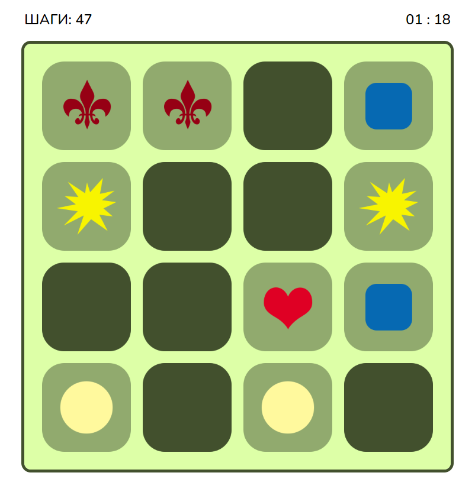

# Memory Cards Game
## Description
A simple memory cards game features counting steps and time passed
The app was built using `TypeScript`, `Node.js` and `pixi.js`

## How to Run
Go to `dist` directory and run the following command in PowerShell
```
localhost
```
